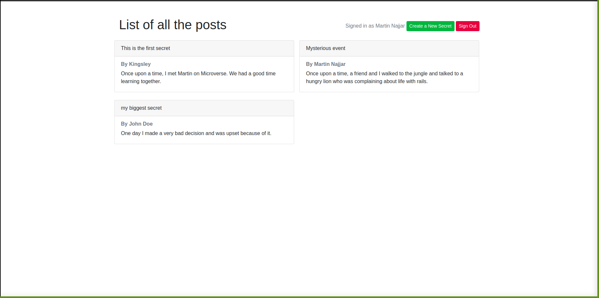

# Members only

> In this project we have:
>
> - Used Devise to authenticate users
> - Implemented sign in, sign out and sign up features
> - Used Bootstrap to layout the pages

## Built with

- Rails 6.0.3.4
- Ruby 2.7.1
- Bootstrap
- Devise

## Getting Started

To get a local copy up and running follow these simple example steps.

### Prerequisites

You should have [Ruby 2.7.1](https://www.ruby-lang.org/en/documentation/installation/) installed on your machine along with [Rails 6.0.3.4](http://railsinstaller.org/en) and [PostgreSQL](https://www.postgresql.org/download/).

**Note:** You need to create a user(role) after you install PostgreSQL in order to user it on your local machine.

### Setup

Open your terminal, type `git clone https://github.com/martinnajjar12/members-only.git` and hit Enter to download this repository.

### Install

- At first, make sure that you have `bundler` installed on your machine. Again in your terminal type the command `bundler -v`. If a version showed up, skip the next step, if not please continue.
- Type the command `gem install bundler` and hit Enter to install bundler on your machine.
- Now you're ready to start! Type in your terminal `bundle install` to get the required dependencies to run this project.
- At the end, run `yarn install --check-files` to install the additional important dependencies.
- Last but not least, run `rails db:create` and `rails db:migrate` to setup your

### Usage

To use this project you should:

- Inside your terminal run `rails server` to run the server.
- Inside your browser type `localhost:3000` to view the home page.
- You need to sign up in order to see the names of the authors and create a new secrets.

## Author 1

- Github: [@martinnajjar12](https://github.com/martinnajjar12)
- Twitter: [@martin_najjar](https://twitter.com/martin_najjar)
- LinkedIn: [Martin Najjar](https://www.linkedin.com/in/martinnajjar12/)

## Author 2

- Github: [@githubhandle](https://github.com/Kingobaino1)
- Twitter: [@twitterhandle](https://twitter.com/ibehkingso)
- Linkedin: [linkedin](https://www.linkedin.com/in/kingsley-ibeh)

## 🤝 Contributing

Contributions, issues and feature requests are welcome! Start by:

- Forking the project
- Cloning the project to your local machine
- `cd` into the project directory
- Run `git checkout -b your-branch-name`
- Make your contributions
- Push your branch up to your forked repository
- Open a Pull Request with a detailed description to the development branch of the original project for a review

## Show your support

Give a ⭐️ if you like this project

## License

This project is [MIT](https://github.com/martinnajjar12/members-only/blob/build-app/LICENSE) licensed.
